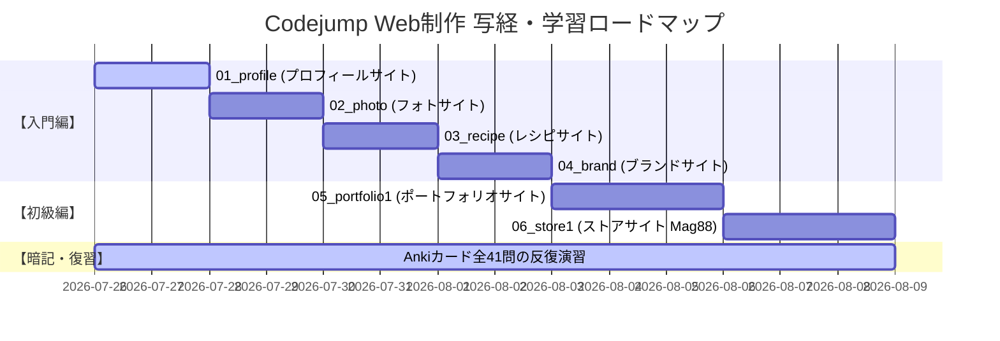

# 📅 Codejump Web制作 学習ロードマップ ＆ ガントチャート

本リポジトリの全6課題 ＋ Anki問題演習（全41問）をスムーズに完遂するための標準スケジュール（約2週間）です。

---

## 📊 ガントチャート（Mermaid表示）

GitHub上で直接インタラクティブにレンダリングされます。

---

## 🗓 デイリースケジュール

| 日数 | 対象課題 / タスク | 内容 | 対応Issue |
| :--- | :--- | :--- | :--- |
| **Day 1-2** | **01_profile** | 1カラム基礎、`line-height: 1px`、3列カード均等配置 | [#1](https://github.com/coron214/codejump-practice/issues/1) |
| **Day 3-4** | **02_photo** | 2層幅制御、`<ol>`目次、`<dl>`定義リストのFlex表組み | [#2](https://github.com/coron214/codejump-practice/issues/2) |
| **Day 5-6** | **03_recipe** | `100vh` 全画面表示、`calc(100%/3)` 3等分、隙間消去 | [#3](https://github.com/coron214/codejump-practice/issues/3) |
| **Day 7-8** | **04_brand** | `vw` 単位配置、Google Fonts、`column-reverse` 順序反転 | [#4](https://github.com/coron214/codejump-practice/issues/4) |
| **Day 9-11** | **05_portfolio1** | `<picture>` デバイス画像切替、フォーム＆`<label>` 設計 | [#5](https://github.com/coron214/codejump-practice/issues/5) |
| **Day 12-14** | **06_store1** | `position: absolute;` テキスト重ね、`::before` 箇条書き | [#6](https://github.com/coron214/codejump-practice/issues/6) |
| **毎日平行** | **Anki暗記** | デッキ `Web制作::Codejump` (全41問) の毎日復習 | [#7](https://github.com/coron214/codejump-practice/issues/7) |

---

## 📌 GitHub Projects での Roadmap（ガントチャート）表示手順

GitHub Projects（V2）の **Roadmap ビュー** 機能を使うと、GitHub上でもガントチャート（タイムライン表示）が利用できます。

1. GitHubリポジトリの **Projects** タブ、または GitHub アカウントの **Projects** から新規プロジェクトを作成
2. ビューのレイアウト切り替えで **「Roadmap」** を選択
3. 各 Issue の `Start date`（開始日）と `Target date`（完了目標日）を設定すると、インタラクティブなガントチャートバーが表示されます。
